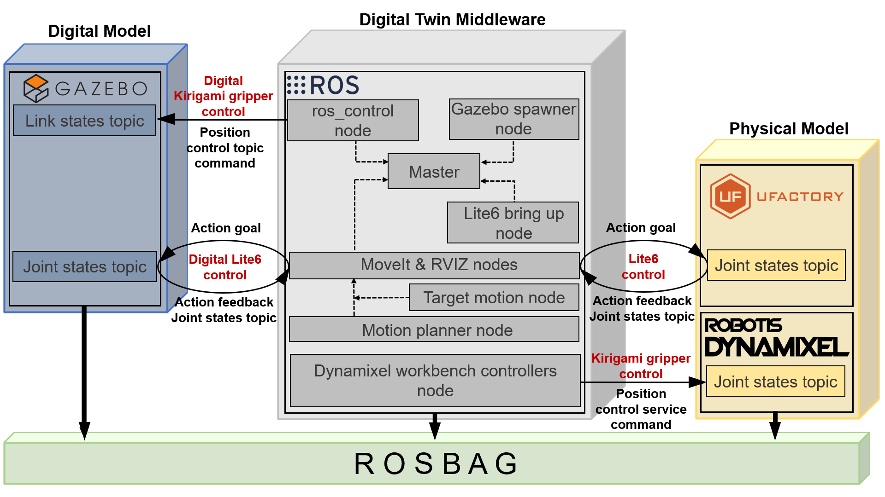
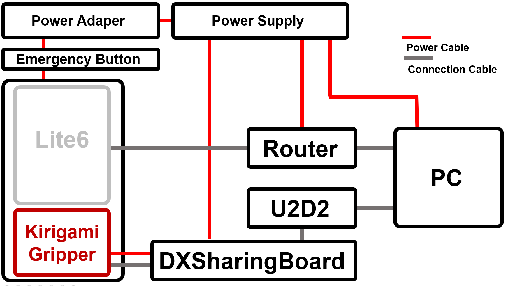
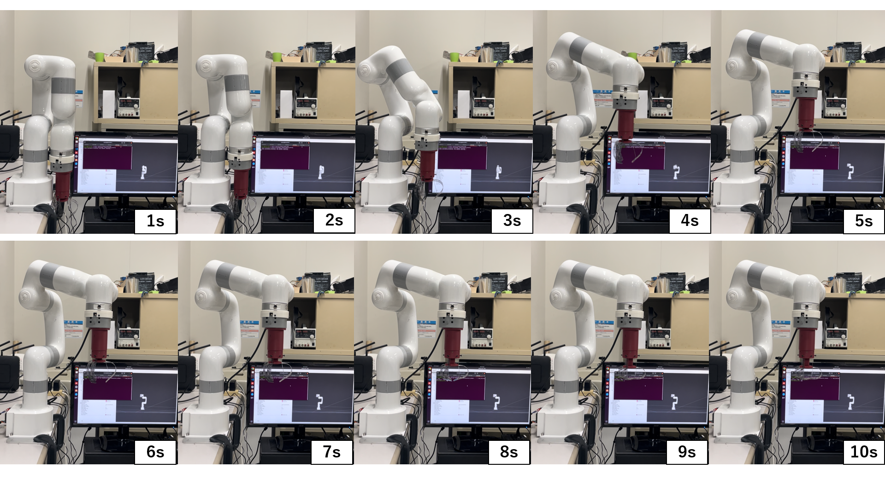
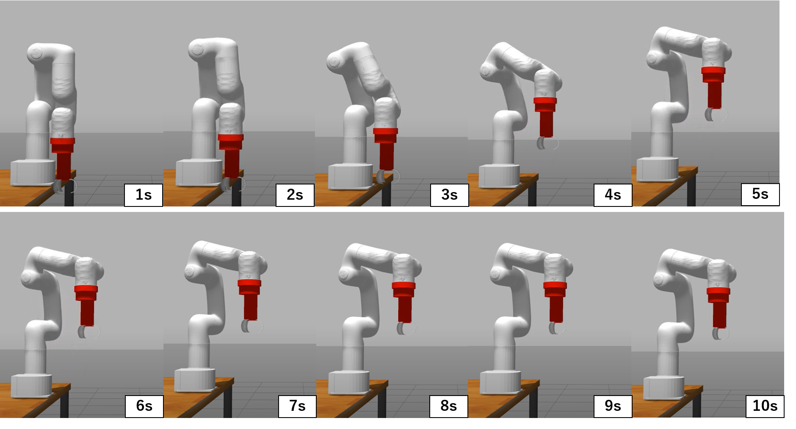

# Development of ROS Digital Twin System for Robot Arm with Kirigami Gripper
* This package was taken from an existing one and rebuilt for my research.
* This packages are for knowledge sharing purposes and are non-commercial.
* Only Japanese and English are supported. 

[**QiitaLink by RENOX**](https://qiita.com/RENOX)<br>
**Copyright (c) 2018, UFACTORY Inc.**<br>
**Copyright 2023, RENOX**<br>
Subject to the existing rights of third parties, RENOX is the owner of the copyright in this work, and no portion hereof is to be copied, reproduced, or disseminated without the prior written consent of RENOX.

# Contents
* [1. Introduction](#1-introduction)
* [2. Get started ROS](#2-get-started-ros)
* [3. Get started creating default workspace](#3-get-started-creating-default-workspace)
* [4. Get started creating research workspace](#4-get-started-creating-research-workspace)
* [5. Tutorial](#5-tutorial)
    * [5.1 Display lite6 with kirigami gripper in RVIZ](#51-display-lite6-with-kirigami-gripper-in-rviz)
    * [5.2 Simple control the GAZEBO model with MoveIt](#52-simple-control-the-gazebo-model-with-moveit)
* [6. Inspection of ROS Digital Twin System](#6-inspection-of-ros-digital-twin-system)
    * [6.1 Physical layer experiment](#61-physical-layer-experiment)
        * [6.1.1 Preparation of motion planning](#611-preparation-of-motion-planning)
        * [6.1.2 Preparation of DYNAMIXEL motor](#612-preparation-of-dynamixel-motor)
        * [6.1.3 Experiment using physical robot arm and gripper](#613-experiment-using-physical-robot-arm-and-gripper)
    * [6.2 Digital layer experiment](#62-digital-layer-experiment)
    * [6.3 Record topic data](#63-record-topic-data)
* [7. Important Notice](#7-important-notice)


# 1. Introduction
I developed digital twin system using ROS Noetic. <br>
Physical layer is [**UFACTORY Lite 6**](https://github.com/xArm-Developer/xarm_ros) and [**BioLinMech Lab Kirigami Gripper**](http://www.malab.se.ritsumei.ac.jp/top/index_e.php), and digital layer is **GAZEBO**.<br>
The gripper has [**DYNAMIXEL XM430-W210**](https://emanual.robotis.com/docs/en/software/dynamixel/dynamixel_workbench/) inside.

# 2. Get started ROS
Setup your computer to accept software from packages.ros.org.
```bash
$ sudo sh -c 'echo "deb http://packages.ros.org/ros/ubuntu $(lsb_release -sc) main" > /etc/apt/sources.list.d/ros-latest.list'
```
If you haven't already installed curl, install curl. And run the following command.
```bash
$ sudo apt install curl
$ curl -s https://raw.githubusercontent.com/ros/rosdistro/master/ros.asc | sudo apt-key add -
```
First, make sure your Debian package index is up-to-date and install ROS Noetic.
```bash
$ sudo apt update
$ sudo apt install ros-noetic-desktop-full
```
You must source this script in every bash terminal you use ROS in.
```bash
$ echo "source /opt/ros/noetic/setup.bash" >> ~/.bashrc
$ source ~/.bashrc
```
To install this tool and other dependencies for building ROS packages, run
```bash
$ sudo apt install python3-rosdep python3-rosinstall python3-rosinstall-generator python3-wstool build-essential
```
If you have not yet installed rosdep, do so as follows
```bash
$ sudo apt install python3-rosdep
```
With the following, you can initialize rosdep.
```bash
$ sudo rosdep init
$ rosdep update
```
Install gazebo_ros_pkgs.
```bash
$ sudo apt-get install ros-noetic-gazebo-ros-pkgs ros-noetic-gazebo-ros-control
```
Install ros_control.
```bash
$ sudo apt-get install ros-noetic-ros-control ros-noetic-ros-controllers
```
Install MoveIt.
```bash
$ sudo apt install ros-noetic-moveit
```

# 3. Get started creating default workspace
## 3.1 Create a workspace
```bash
$ mkdir -p ~/research_ws/src
$ cd ~/research_ws/src
$ catkin_init_workspace
$ cd ~/research_ws
$ catkin_make
```

## 3.2 Obtain the Lite 6 package
```bash
$ cd ~/research_ws/src
$ git clone https://github.com/xArm-Developer/xarm_ros.git --recursive
```

## 3.3 Update the package
```bash
$ cd ~/research_ws/src/xarm_ros
$ git pull
$ git submodule sync
$ git submodule update --init --remote
```
## 3.4 Install other dependent packages
```bash
$ rosdep update
$ rosdep check --from-paths . --ignore-src --rosdistro noetic
```
If there are any missing dependencies listed. Run the following command to install
```bash
$ rosdep install --from-paths . --ignore-src --rosdistro noetic -y
```

## 3.5 Build the code
```bash
$ cd ~/research_ws
$ catkin_make
```

## 3.6 Source the setup script
```bash
echo "source ~/research_ws/devel/setup.bash" >> ~/.bashrc
source ~/.bashrc
```

## 3.7 Check default environment
```bash
$ roslaunch xarm_description lite6_rviz_display.launch
```
# 4. Get started creating research workspace
## 4.1 Remove unnecessary packages
```bash
rm -rf doc dual_xarm6_moveit_config examples xarm5_gripper_moveit_config xarm5_moveit_config xarm6_gripper_moveit_config xarm6_moveit_config xarm7_gripper_moveit_config xarm7_moveit_config xarm_gazebo xarm_gripper xarm_vision ReadMe.md ReadMe_cn.md ReadMe_others.md
```
## 4.2 Obtain the robot_arm package
```bash
$ cd ~/research_ws/src/xarm_ros
$ git clone https://github.com/RENOX-DATABASE/lite6.git
```

## 4.3 Obtain the mimic joint plugin package
```bash
$ cd ~/research_ws/src/xarm_ros
$ git clone https://github.com/roboticsgroup/roboticsgroup_gazebo_plugins.git
```
## 4.4 Obtain and Build the  Dynamixel Workbench package
Download library.
```bash
$ cd ~/research_ws/src/xarm_ros
$ git clone https://github.com/ROBOTIS-GIT/dynamixel-workbench.git
$ git clone https://github.com/ROBOTIS-GIT/dynamixel-workbench-msgs.git
$ git clone https://github.com/ROBOTIS-GIT/DynamixelSDK.git
```
Setup the library.
```bash
$ cd ~/research_ws/src/xarm_ros/DynamixelSDK/c++/build/linux64
$ make
```
Setup DYNAMIXEL Workbench library.
```bash
$ cd ~/research_ws/src/xarm_ros/dynamixel-workbench/dynamixel_workbench_toolbox/examples
$ mkdir -p build && cd build
$ cmake ..
$ make
```
Setup U2D2.
```bash
$ wget https://raw.githubusercontent.com/ROBOTIS-GIT/dynamixel-workbench/master/99-dynamixel-workbench-cdc.rules
$ sudo cp ./99-dynamixel-workbench-cdc.rules /etc/udev/rules.d/
$ sudo udevadm control --reload-rules
$ sudo udevadm trigger
```

## 4.5 Build the code
```bash
$ cd ~/research_ws
$ catkin_make
```

# 5. Tutorial
Here chapter explain the simple tutorial how to use.
## 5.1 Display lite6 with kirigami gripper in RVIZ
```bash
$ roslaunch lite6 lite6_with_kirigami_gripper_rviz.launch
```

## 5.2 Simple control the GAZEBO model with MoveIt
First, run the following command and spawn GAZEBO world.
```bash
$ roslaunch lite6 lite6_with_kirigami_gripper_gazebo.launch
```
Second, run the following command and launch RVIZ for MoveIt.
```bash
$ roslaunch lite6 lite6_with_kirigami_gripper_moveit.launch
```
If you want to move the kirigami gripper in GAZEBO, run the following command.
Close the kirigami gripper.
```bash
$ rostopic pub /robot_arm_sim/gripper_position_controller/command std_msgs/Float64 "data: -0.47"
``` 
Open the kirigami gripper.
```bash
$ rostopic pub /robot_arm_sim/gripper_position_controller/command std_msgs/Float64 "data: 0.10"
``` 
If the gripper is unstable, adjust PID in gripper_position_controller of lite6_with_kirigami_gripper_controller.yaml.
```yaml:lite6_with_kirigami_gripper_controller.yaml
gripper_position_controller:
  type: effort_controllers/JointPositionController
  joint: finger1_joint
  pid: {p: 5.0, i: 0.0, d: 0.0}
```

# 6. Inspection of ROS Digital Twin System
Here chapter explain the procedure of the actual experiment.
An overview of the system is shown below.
 
## 6.1 Physical layer experiment
The experimental environment is shown below.
 
### 6.1.1 Preparation of motion planning
Create motion planning cpp file.
```bash
$ cd ~/research_ws/src/xarm_ros/xarm_planner/src
$ touch research_motion_planning.cpp
$ gedit research_motion_planning.cpp
```
And copy&past the following code.
```c++
#include "ros/ros.h"
#include <std_msgs/Bool.h>
#include <xarm_planner/pose_plan.h>
#include <xarm_planner/joint_plan.h>
#include <xarm_planner/exec_plan.h>
#include <xarm_planner/single_straight_plan.h>
#include <stdlib.h>
#include <vector>

bool request_plan(ros::ServiceClient& client, xarm_planner::joint_plan& srv)
{
	if(client.call(srv))
	{
		return srv.response.success;
	}
	else
	{
		ROS_ERROR("Failed to call service joint_plan");
		return false;
	}
}
bool request_plan(ros::ServiceClient& client, xarm_planner::pose_plan& srv)
{
	if(client.call(srv))
	{
		return srv.response.success;
	}
	else
	{
		ROS_ERROR("Failed to call service pose_plan");
		return false;
	}
}
bool request_plan(ros::ServiceClient& client, xarm_planner::single_straight_plan& srv)
{
	if(client.call(srv))
	{
		return srv.response.success;
	}
	else
	{
		ROS_ERROR("Failed to call service single_straight_plan");
		return false;
	}
}
bool request_exec(ros::ServiceClient& client, xarm_planner::exec_plan& srv)
{
	if(client.call(srv))
	{
		return srv.response.success;
	}
	else
	{
		ROS_ERROR("Failed to call service exec_plan");
		return false;
	}
}

int main(int argc, char** argv)
{	
	std::vector<double> tar_joint1 = {-1.0, -0.75, 0.0, -0.5, 0.0, 0.3, 0.0};
	std::vector<double> tar_joint2 = {0.0, 0.0, 0.0, 0.0, 0.0, 0.0, 0.0};
	std::vector<double> tar_joint3 = {1.0, -0.75, 0.0, -0.5, 0.0, -0.3, 0.0};

	ros::init(argc, argv, "xarm_simple_planner_client");
	ros::NodeHandle nh;
	ros::ServiceClient client = nh.serviceClient<xarm_planner::joint_plan>("xarm_joint_plan");
	ros::ServiceClient client2 = nh.serviceClient<xarm_planner::pose_plan>("xarm_pose_plan");
	ros::ServiceClient client_exec = nh.serviceClient<xarm_planner::exec_plan>("xarm_exec_plan");

	ros::Publisher exec_pub = nh.advertise<std_msgs::Bool>("xarm_planner_exec", 10);
	std_msgs::Bool msg;
	xarm_planner::joint_plan srv;
	xarm_planner::pose_plan srv2;
	xarm_planner::exec_plan srv_exec;
	//********************************************************************
	ros::ServiceClient client22 = nh.serviceClient<xarm_planner::pose_plan>("xarm_straight_plan");
	std::vector<double> tar_joint22 = {-19.9/57.3, 16.9/57.3, 0.8/57.3, 21.5/57.3, -2.9/57.3, 4.6/57.3, -16.3/57.3};
	xarm_planner::single_straight_plan srv22;

	double slp_t = 0.5;
	geometry_msgs::Pose target1;
	target1.position.x = 0.2;
	target1.position.y = -0.1;
	target1.position.z = 0.4;
	target1.orientation.x = 1;
	target1.orientation.y = 0;
	target1.orientation.z = 0;
	target1.orientation.w = 0;
	
	srv.request.target = tar_joint22;
	if(request_plan(client, srv))
	{
		ROS_INFO("Plan SUCCESS! Executing... ");
		srv_exec.request.exec = true;
		request_exec(client_exec, srv_exec);
	}
	ros::Duration(slp_t).sleep(); // Wait for last execution to finish

		srv22.request.target = target1;
		if(request_plan(client22, srv22))
		{
			ROS_INFO("Plan SUCCESS! Executing... ");
			srv_exec.request.exec = true;
			request_exec(client_exec, srv_exec);
		}

	return 0;
}
```
Add the following code to CMakeLists.txt of xarm_planner package.
```txt:CMakeList.txt
## ADD ##
add_executable(research_motion_planning src/research_motion_planning.cpp)
add_dependencies(research_motion_planning ${${PROJECT_NAME}_EXPORTED_TARGETS})
add_dependencies(research_motion_planning xarm_msgs_generate_messages_cpp)
target_link_libraries(research_motion_planning ${catkin_LIBRARIES})
#########

install(DIRECTORY launch DESTINATION ${CATKIN_PACKAGE_SHARE_DESTINATION})
install(TARGETS
  xarm_simple_planner
  xarm_simple_planner_test
  xarm_simple_planner_test2
 ## Add ##
  research_motion_planning
 #########
  xarm_gripper_planner
  ARCHIVE DESTINATION ${CATKIN_PACKAGE_LIB_DESTINATION}
  LIBRARY DESTINATION ${CATKIN_PACKAGE_LIB_DESTINATION}
  RUNTIME DESTINATION ${CATKIN_PACKAGE_BIN_DESTINATION}
)
```
### 6.1.2 Preparation of DYNAMIXEL motor
| Preparation device |
|:-----------------|
| DYNAMIXEL Motor XM430-W210 (Kirigami gripper) | 
| U2D2 |
| DXSharingBoard |
| Robot Cable-X4P(JST Cable) |
| Robot Cable-X4P(Molex-JST Convert Cable) |
| MicroB to A Cable |
| Power Supply |

Create motor of kirigami gripper setting file.
```bash
$ cd ~/research_ws/src/xarm_ros/xarm_planner/src
$ touch my_joint_xm430w210_extpos.yaml
$ gedit my_joint_xm430w210_extpos.yaml
```
And copy&past the following code.
```yaml:my_joint_xm430w210_extpos.yaml
#Extended Position Control Mode (extpos)
kirigami_gripper:
  ID: 1
  Return_Delay_Time: 0
  Operating_Mode: 4
  Profile_Acceleration: 0
  Profile_Velocity: 0
  Position_P_Gain: 6000
```
Change the followimg code of dynamixel_controllers.launch.
```xml:dynamixel_controllers.launch
<!--Change yaml file name-->
  <param name="dynamixel_info" value="$(find dynamixel_workbench_controllers)/config/my_joint_xm430w210_extpos.yaml"/>
```

### 6.1.3 Experiment using physical robot arm and gripper
First, set dynamixel_workbench_controllers for kirigami gripper.
```bash
$ roslaunch dynamixel_workbench_controllers dynamixel_controllers.launch
```
Second bring up Lite6 and RVIZ for MoveIt.
```bash
$ roslaunch xarm_planner xarm_planner_realHW.launch robot_ip:=<　Input your lite6 ip　>
```
Third, start motion planning if the previous command completed launching
```bash
$ rosrun xarm_planner research_motion_planning
```
Fourth, start the kirigami gripper motion if the previous command completed moving.<br>
Close the kirigami gripper.
```bash
$ rosservice call /dynamixel_workbench/dynamixel_command -- '' 1 'Goal_Position' -6144
```
Open the kirigami gripper.
```bash
$ rosservice call /dynamixel_workbench/dynamixel_command '' 1 'Goal_Position' 2048
```
Above position goal value depends on how the gripper is assembled.
 
## 6.2 Digital layer experiment
First, set the kirigami gripper initail position.
```bash
$ roscore
$ rostopic pub /robot_arm_sim/gripper_position_controller/command std_msgs/Float64 "data: 0.10"
```
Second, run the following command and spawn GAZEBO world.
```bash
$ roslaunch lite6 lite6_with_kirigami_gripper_gazebo.launch
```
Third, run the following command and launch RVIZ for MoveIt.
```bash
$ roslaunch lite6 moveit_planner_sim.launch
```
Fourth, start motion planning if the previous command completed launching
```bash
$ rosrun xarm_planner research_motion_planning
```
Fifth, start the kirigami gripper motion if the previous command completed moving.<br>
Close the kirigami gripper.
```bash
$ rostopic pub /robot_arm_sim/gripper_position_controller/command std_msgs/Float64 "data: -0.47"
``` 
Open the kirigami gripper.
```bash
$ rostopic pub /robot_arm_sim/gripper_position_controller/command std_msgs/Float64 "data: 0.10"
``` 
 
## 6.3 Record topic data
Start recording. If you haven't run launch file yet, run roscore.
```bash
roscore
rosbag record -a -O bagfilename
```
Check the recorded data. If you haven't run launch file yet, run roscore.
```
roscore
rqt_bag bagfilename.bag
```

# 7. Important Notice
* `sudo apt-get upgrade` is deprecated.
If you run the above command, the version of librviz_visual_tools.so will be upgraded and you will get an error in xarm_simple_planner.cpp. Comment out the line about rviz_visual_tools to get rid of the error.
* Problem with srdf file but currently MoveIt works.
* The kirigami gripper model begins to collapse over time in digital layer experiment.

---
**GitLink**<br>
**Designed by RENOX**
